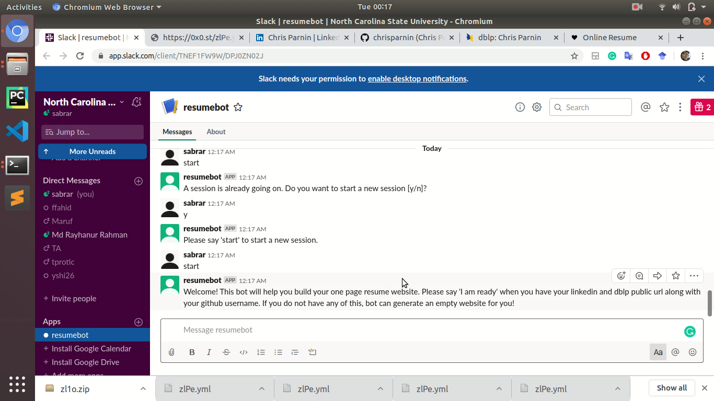
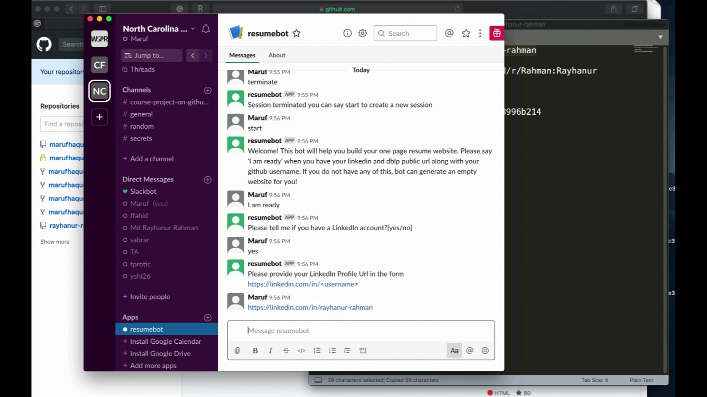
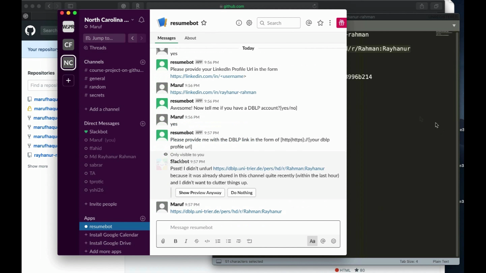
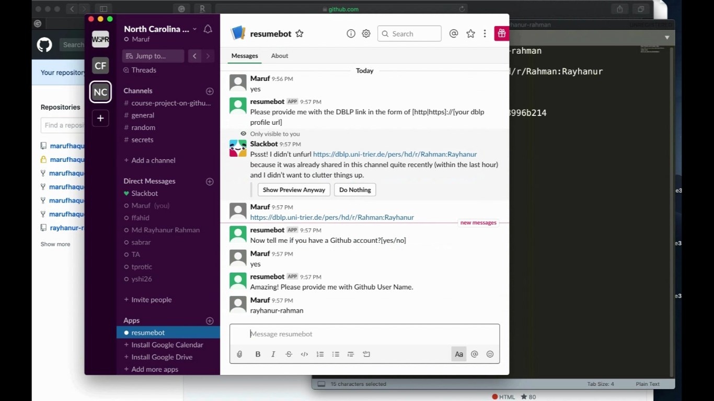
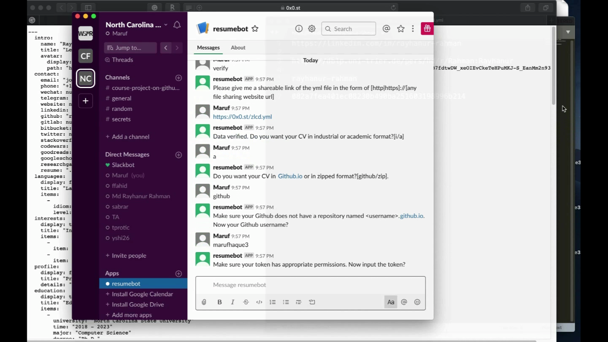
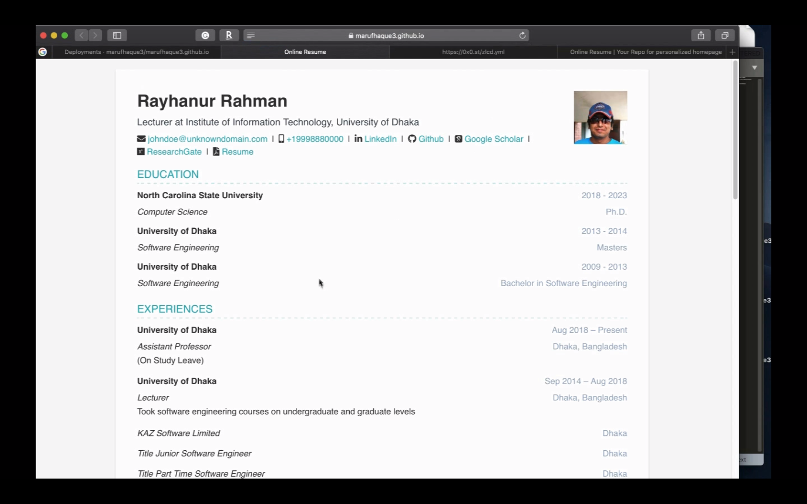
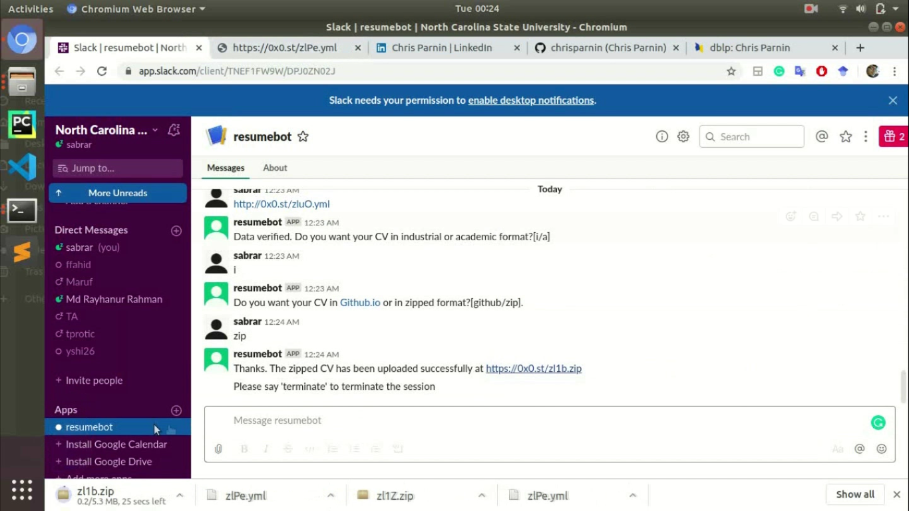
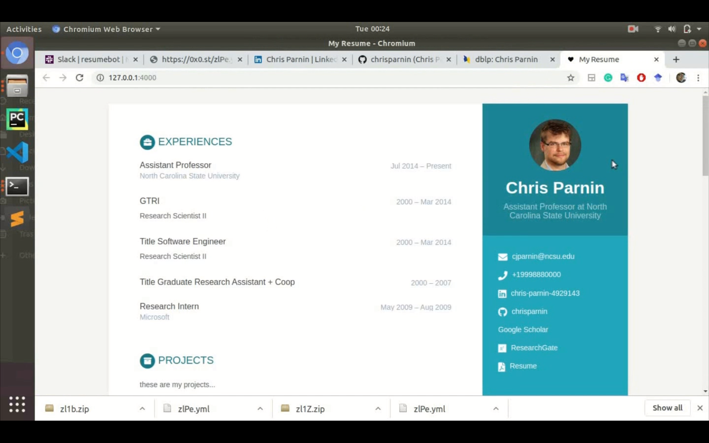

# Report
## The problem our bot solved
In a competitive academic and job industry, having a resume like personal webpage is a must. But often times, developing such a website from scratch is somewhat tedious and time consuming, However, many of us already maintain their academic, job, projects and research profiles in popular web services like LinkedIn, Github etc. Therefore, keeping that in mind, our plan is to create a bot that is able to put together a personal resume like website based on various public profiles such as LinkedIn, Github, DBLP index etc and the information that is fed to the bot by the person itself through the conversation with the bot. Meanwhile these days, slack provides a lot of options for developers to build bots that can do such interesting thing using the slack bot api. Thus one can easily resuse their information from those websites and get a set of static html and css pages that will be hosted as a personal resume webpage generated by a slack bot. It will save the user from spending time and tedious work on building html and css contents from the scratch. The bottom line is, this bot will help the user build a personal resume website without writing web contents from the scratch through importing information from Linkedin, GitHub etc. Once, the static webpages have been generated, the user can modify it within his/her needs.

## Primary features and screenshots
### Primary features
1. The Resume builder bot is a Slack-based interactive conversational bot which simplifies the mundane (in the sense that it handles the formatting and ornamentation) task of buidling a resume website.
2. The bot provides the user various alternatives to start their new resume website with different templates (academic/industrial) according to the user's taste and need.
3. The bot continues with the conversation bringing out important information that it needs from the user.
4. Hence, with the necessary information, it extracts user profile information such as the publication list, projects, employment history, skillset, etc from sites like LinkedIn, DBLP index, GitHub, etc. If a user does not maintain any profile in the aforementioned services, bot provides a template where user can put all the information.
5. Once the bot completes its task, it replies in Slack with a link to the homepage within which the CV is also availiable if user opts to host the site in github.io or provide a static webpage files in zipped format that can be used to publish the site in any host.

Here are some of the glimpses of our bot in action.

Use Case 1 in action.

Use Case 2 in action.

User requiring the files to be deployed on github.

The resume website published in github.io

User requiring the zip file in use case 3.

The resume website built by the bot that is published using `jekyll serve`

## Our reflection on the development process and project.
* Setting up short iterations and milestones helped being focused and motivated. If the iteration/milestones were long, lack of focus and procastination could have been an issue
* Scrum meetings helped sharing, collaborating and updating about the project status regularly. It also provided an extra boost of motivation to finish the assigned tasks.
* Github Project Tracking provided live updates about all the activities of every team member which helped keeping the project in track and accommodate any necessary change accordingly in order to finish all the tasks within the milestone
* Short Tasks/Stories helped a lot because, if somebody got stuck, it was easier to hand the task to somebody else and get other tasks done. If it were a big task, then it was possible that somebody got stuck and all other dependent feature implementation also got stuck
* Pair Programming was particularly useful while merging all other feaures, conflict resolution or debugging a hard-to-find bugs.
* There was always a backup member assigned who can take up the task if the first assignee struggles to complete the task. It was needed particularly in the case of implementing a feature that can be done alternatively with numerous npm packages but none of those are working according to the expectation.
* Task Prioratization was a key to complete all the tasks. In the midway of iteration, the most important tasks that need to be done was decided in regular scrum meeting. Hence, tasks like refactoring got delayed because some more important tasks got preference over it
* After every merging, the bot functionalities has been tested thoroughly so that it was checked that nothing is broken that's been working fine previously. Before every scrum, a project build was also performed.
* Deployment came with a lot of challenges. Even though the use of Ansible and Jenkins helped us avoiding redoing certain things, we had to go a few extra miles to deploy the application in production mode. 
* Software architecture can be seen as a decision making process; it involves making the right decisions at the right time. Typically, these design decisions are not explicitly represented in the artifacts describing the design. Instead, they reside in the minds of the designers and are therefore easily lost. Thus designing of the software architecture and the design patterns at the onset of our project and always keeping documentation of what we are intending to do was very helpful in implementing our future work.
* Our bot application, being identified as an utility bot, helped us take important design decisions. For example, we needed our bot to fetch data from several places to gather the required information to generate the homepage. Therefore, we decided on using the Repository design pattern while diving into our implementation.
* In addition to that, we identified that we needed to work in collaboration in a group. That is why we decided on using a Layered architecture, so that we could perform our tasks independently.
* Framing the use cases very early in the project lifecycle helped us a lot in making our design decisions. For example, our usecases required us to maintain states of the conversations so that we might identify which stage of the conversation an user is in. In addition, there might be situations when we do not want our bot to start off from the very beginning. Therefore, we decided on using the Memento design pattern that will help us checkpointing the current state of conversations and maybe resume it at a later point.
* Having been involved in previous projects also helped us in taking crucial design decisions such as separating complex object construction from its representation. Therefore, it helped us taking the decision of choosing the Builder pattern

* One of the problems that we faced while implementing the bot functionalities is take care of all the possible alternate chat pathways and the user requirements. In the future, we might use a more refined chat framework, as well as go through its documenation more thoroughly. It will help us take care of all the alternate pathways in a conversation with more dexterity.

* We definitely want to try out the Repository design pattern in the future, due to the fact that almost all projects require fetching of data. So, assuming the fact that we am working on another project, we definitely would understand the convenience that Repository pattern provided us with while doing this project.

* While doing this project in collaboration with others, making one's task independent of the task of other members was important, so that, even if one developer is stuck in something, the others might carry on with their tasks. So in the future projects that involves collaboration with other developers, we will definitely opt for Layered architecture.

* In the project that we are currently doing, we have identified our bot design pattern as a conversationist bot. However, in the future, if we happen to work on a bot project, we will definitely try to use different bot design patterns, such as the notifiers, reactors, space reactors, responders, etc that suits the use case of the project.

* Some of the npm packages such as Puppeteer, nock helped us in integration tests and mocking respectively.

* GitHub, DBLP had very clear API, so preparing the mock data based on what their API calls returned was particularly easy to do.

* Puppeteer had full support for XPath and so scraping webpages for browser automation turned out to be an effective way for integration testing.

* As we had already implemented the service functions that were required for the happy path as per the requirement of the project, it helped us brainstorm several test cases that we used for integration testing. Due to the brainstorming, several loopholes and bugs in conversation flow popped up and helped us in fixing them.
* Integration of the components was particularly a difficult thing to do in our project and hence only performing unit tests was not enough. So, in line with our thought, integration tests brought out some important bugs in connecting our components.
* As we used a big bang approach to integration testing, some of the service level functions were not yet implemented. So, in this case, mocking some of the service functions helped us in completing the task.
* Analyzing a test failure sometimes required long time to identify. We have used extensive and exhaustive logging to identify the possible errors. But the thing is, exhaustive logging can have a significant effect on performance and it should be done only when needed. In the future, we intend to use a competent logging framework that can be controlled via flags that allow for minimal logging during normal production usage and progressively more detail to be logged in the event of a problem.
* In the future, we want to use function stubs as we have used in this project on a small scale. It is because at the point of testing, many of the service functions might not be implemented completely. In addition to that, while performing unit tests, tasks that depend on external sources, such as populating the databases, getting user info,etc might take up a lot of time. As the purpose of unit testing is not to identify this external dependencies, we plan to use function stubs and mocking in a more extensive way in my future projects.

* The regular Scrum meetings that we scheduled in two-day intervals were very helpful in designing and implementating the scrum-ban.
* Fragmentation of our usecases into smaller stories helped us building design our Kanban board and allowed us visualizing the tasks at hand. Assigning story points also helped us in distributing the tasks equally among the collaborators.
* Relatively shorter iterations and sprint development cycle of 1 week was also helpful in the implementation of our scrum-ban in the sense that we could plan out the meaningful progress we intend to achieve in this time.
* The Git Kanban board helped us integrate the issues with the board and hence making the things more meaningful from the project's perspective.
* Some of the tasks that we planned to finish within the specified sprint cycle did not finish within the time period. In addition to that, we underestimated the time period and difficulty of some of the problems. Hence, they were backlogged into the next sprint cycle. So, next time, via elobarate discussions in the scrum meetings, we plan to identify and analyze the tasks further to make good assumptions about the difficulty and the time required for any underlying task.
* Once some of the tasks in our first iteration were backlogged, we adopted pair programming to solve the tasks that were particularly difficult to implement individually.
* NPM has so many alternatives for a single task and thats why choosing an appropriate package was particularly challenging. So, while addressing the later tasks, we always had someone else other than the person assigned to do the task to search alternative ways to complete the task.
* We would definitely use Kanban boards in conjunction with scrum in our future projects as it provides a clear insight into the progress of the project as well as dividing the tasks up equally among the collaborators.
* We would definitely try out the pair programming approach for more difficult and time-consuming tasks. As it turned out to be really fruitful in our current project, we intend to use it in our future projects as well.
In the future projects, we intend to assure necessary level of analysis before going onto development.
* Prioritization on demand that provides insight into the ideal work planning process should always provide the team with the best thing to work on next. Hence, we intend to implement this practice in our future projects.

## Any limitations and future work.
1. Our current bot does not provide a large array of templates as option to the user. In the future, we would like to add sufficient choices of templates and look-and-feel for the user.
2. In the future, we would like to add additional public profiles other than GitHub, LinkedIn and DBLP to mine the information of the user. Hence, we will be able to create a more elaborate and thorough picture of the portfolio of the user.
3. The conversation with the bot is clunky as of now. In the future, we would like to beautify the conversation with the bot, with our bot providing visualizations, options to pick from,etc. There are also options to refactor the conversation further. 
4. For the implementation of our conversation pipeline, we have made use of BotKit.Ai version 0.7.0. In the future, we intend to use version 4.0 which provides more advanced options in conversation.
5. As of now, our bot is in action in the slack platform. However, our work can also be extended to platforms like Snapchat,Skype,etc.
6. We intend to handle multiple conversations with the bot in the future.
7. Implementing the LinkedIn Api was difficult to implement and also time consuming. Rather we used web scrapping to eke out the data from LinkedIn. In the future, we would like to leverage the LinkedIn API to mine the data.
8. Pushing the resume website files into GitHub for deployment is currently clunky in the sense that it pushes one file at a time. Hence it takes time to push the files especially when we request the industry template. In the future, we intend to mke the implementation of GitHub pushing more robust using the ideas of references. 
9. We have performed authentication in GitHub using tokens from time to time. In the future, webhooks could be implemented to perform authentication.
## Project Demo

The link to the demo of the project is provided [here](
https://drive.google.com/file/d/135LdEpPpIEmSDxDC85p1lBBtIF0g9bar/view?fbclid=IwAR0jRXDKFGs3QDUUCMfFmLhfI9xT3VB-D4FV5TAQODsrlgofMErcMwyyoYI).
