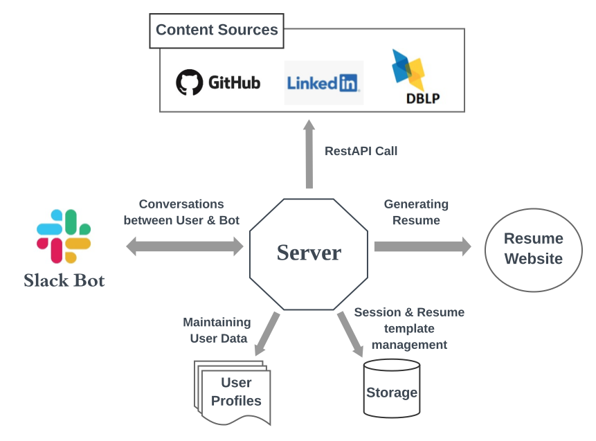

# Static Resume Website Builder BOT
## 1. Problem Statement
In a competitive academic and job industry, having a resume like personal webpage is a must. But often times, developing such a website from scratch is somewhat tedious and time consuming, However, many of us already maintain their academic, job, projects and research profiles in popular web services like LinkedIn, Github etc. Therefore, keeping that in mind, our plan is to create a bot that is able to put together a personal resume like website based on various public profiles such as LinkedIn, Github, DBLP index etc and the information that is fed to the bot by the person itself through the conversation with the bot. Meanwhile these days, slack provides a lot of options for developers to build bots that can do such interesting thing using the slack bot api. Thus one can easily resuse their information from those websites and get a set of static html and css pages that will be hosted as a personal resume webpage generated by a slack bot. It will save the user from spending time and tedious work on building html and css contents from the scratch. The bottom line is, this bot will help the user build a personal resume website without writing web contents from the scratch through importing information from Linkedin, Github etc. Once, the static webpages have been generated, then the user can modify it within his/her needs. 

## 2. Bot Description
-   The Resume builder bot is a Slack based interactive conversational bot which simplifies the mundane (in the sense that it handles the formatting and ornamentation) task of buidling a resume website.  
-   The bot provides the user various alternatives to start their new resume website with different templates according to the user's taste and need. 
-   The bot will continue with the conversation bringing out important information that it needs from the user.
- Hence, with the necessary information, it will extract user profile information such as the publication list, projects, employment history, skillsets, etc from sites like LinkedIn, DBLP index, Github, etc. If a user does not maintain any profile in the aforementioned services, bot will provide a template where user can put all the information. 
- Once the bot completes its task, it will reply in Slack with a link to the homepage within which the CV is also availiable if user opts to host the site in github.io or provide a static webpage files that can be used to publish the site in any host.

## 3. Use Cases
### 3.1 Use Case # 1: Initiating the Bot
#### Preconditions
The user must join a slack channel and the bot must be invited to the slack channel. 

#### Main Flow
- The user wants to initiate coversation with the bot [S1]. The bot will reply an acknwoledgement message letting the user know that the bot has been initiated [S2].

#### SubFlow
- [S1] User says ```/init``` @bot in the direct communication channel, Slack
- [S2] Having read the command from the user, the bot will reply with an acknowledgement "the bot has been initiated"

### 3.2 Use Case # 2: Pausing and Resuming the Conversation Session
#### Preconditions
The conversation between the user and bot must have been initiated

#### Main Flow
- User wishes to pause the process[S1]. The bot will suspend the session as user requests to pause[S2]. When a user requests to resume the conversation[S3], the bot will reinitiate the conversation [S4].

#### SubFlow
- [S1] User types in ````pause```` @Bot to make the pause request
- [S2] The bot responds by suspending the session and saving the progress of the conversion and the tasks
- [S3] User types in ````resume```` @Bot to resume the conversation and restore the tasks it had completed previously
- [S4] The bot fetches the information of the session and reinitiates the conversation from where it left off.

#### Alternate Flow
- [E1] No pausing session found by bot, hence cannot resume any session
 
### 3.3 Use Case # 3: Terminating the Bot
#### Preconditions
- The conversation between the user and bot must have been initiated

#### Main Flow
- The user type wants to terminate the conversation[S1]. The bot will ask the user whether s/he really wants to terminate the session or cancel it[S2]. The bot will send an acknwoledgement message letting the user know that the session has been terminated[S3]

#### Sub Flow
- [S1] The user types in ````kill```` to terminate the conversation
- [S2] the bot asks the user like do you want to terminate or cancel the command. If the user replies no, then the bot will ignore the kill command. But if the user replies yes, the bot will ask the user whether s/he wants to save the session or not.
- [S3] The bot will reply that the session has been terminated. 

#### Alternate  Flow
[E1] If the user replies to save the session, the bot will save the session before terminating.

### 3.4 Use Case 4: Gather Personal Information from the User

#### Precondition
The conversation between the user and bot must have been initiated

#### Main Flow
- The bot will ask the user about his/her public profiles in Linkedin, Github, Dblp profile links[S1]. If the user skips one or more questions asked by the bot, the bot will provide a template to the user to fill out the necessary information[S2]. Hence with all the information, the bot will process all the information in the background and prepare one single profile information which will be presented to the user later.[S3]

#### Subflow
- [S1]  
	- The bot will ask ```Your Github Profile link?```
	- The user will provide the link or type ```/skip```
	- The bot will ask ```Your Linkedin Profile link?```
	- The user will provide the link or type ```/skip```
	- The bot will ask ```Your DBLP Profile link?```
	- The user will provide the link or type ```/skip```
- [S2] Bot will generate a file that holds a template. It requires the user to fill up the necessary missing information
- [S3] Once all the necessary information are filled, the bot will extract informaion from the public profiles, if stated by the user, or scan the file that it required the user to fill up. Hence, it will generate a single file that will hold all the information needed to build the homepage and resume.

#### Alternate Flow
- [E1] If the bot is unable to extract the necessary information inspite of the links being provided, the bot will ask the user to fill up the missing information in the template file it provided.   

### 3.5 Use Case 5: Validate the Information from the User
#### Precondition
- The bot must have prepared the combined file that contains all the relevant information

#### Main Flow
Once the bot has prepared the single file after combining the data from various sources, it will ask the user to validate the information[S1]. If the user replies postively, the bot goes on with the next task[S2].

#### Subflow
- [S1] The bot will display the profile picture and the single file that it has prepared by combining the data from several places. Then the bot asks the user, "Is all the information provided correct?" 
- [S2] If the user replies "Yes", the bot will go on and render the homepage and resume as per the accumulated information 

#### Alternative Flow
- [E1] If the user replies "No", the bot will provide the file and ask the user to correct the wrong information.

### 3.6 Use Case 6: Select Homepage Look and Feel from the User Preference
#### Precondition
- The bot must finalize the file that contains all the relevant information

#### Main Flow
- The bot interacts with the user to know about the template preferences[S1]. User selects any one of the templates[S2]. Once again, bot asks if the resume is for academic or industrial purpose[S3]. The user responds and hence the bot prepares the resume as per the preferences of the user[S4].

#### Subflow 
- [S1] The bot provides a names of various templates as an option to the user
- [S2] The user selects one of them as their preference.
- [S3] The bot asks whether this resume is for academic or industrial purpose.
- [S4] As per the choice of the user, the bot, with the combined file, renders the resume.

### 3.7 Use Case 7: Delivering the Web Contents to the User
#### Precondition 
- The html file containing the static webpage and the pdf file of the homepage and resume must be completed

#### Main Flow
- The bot asks the users as to how it should provide the deliverables[S1]. If the user wants to use the github platform to deploy the homepage[S2], then bot asks for the github token for repo permissions and warns the user of the repo naming convention. Hence the bot pushes the files into a github repo[S3]. After completion of the following tasks, the bot replies with a link to the github repo.[S4]

#### Subflow
- [S1] Bot asks user if "Do you want to deploy the given files in ``github.io.?`` or do you want a zip folder containing the files?"
- [S2] The user replies ``github.io``.
- [S3] The bot requires the github token from the user for authentication, and then it warns the user of the repo naming conventions(there must not be a repo of the same name or else the bot will fail to open a new repo). Then it pushes the files into a github repo.
- [S4] The bot provides the link of the github repo and the homepage to the user.

#### Alternate Flow
- [E1] If user answers ``zip``, the bot will just compress the files in a zip and send it to the user.

# 4. Design Sketches
## 4.1 Storyboard
For commands `\init`, `\pause`, and `\resume`.

For commands `\kill` followed by `no` and `yes` respectively.

The rest of the steps


## 4.2 Wireframe


# 5. Architectural Design
## Diagram


## Architectural Components Description
#### SlackBot
Slack user interface where the user interacts with the chat bot. User can input the commands in a natural conversational language.

#### Content Sources
GitHub, LinkedIN and DBLP are the primary sources for resume content. All of these support REST API to fetch user data. Here, the server will call these APIs to get the resume content based on the metadata provided by user through SlackBot.

#### User Profiles
This is the container for user specific data. It will store data in .yml file format. After fetching data from Content Sources, the server will store it in User Profiles. If any user does not provide any link to any of the content sources, s/he will have to provide data in this .yml file. Before generating the actual resume, the server will give option to user to review the server generated user profile and edit them.

#### Stoage
The storage is required for session management and storing the templates of resume. In case user wants to pause a cv generation session, current details will be stored in a database. When the user wants to resume the previous session, all the existing data can be fetched from database to continue it. All the resumes that will be generated through our system, must follow some specific templates. These templates also need to stored in database and will be selected based on requirement from user.

#### Resume Website
It is the final output of static resume builder. Based on user preference, the server will create a github.io webpage containig the resume or will provide the webpage contents in a compressed directory.

#### Server
Server is main core component of our system. It will control conversation flow with user through SlackBot. Server will fetch user data from GitHub, LinkedIN and DBLP (if available) and will generate the user profile. In other case, it will request the user to update the user profile. After generating the user profile, it will again ask user to review it. Based on the results of review and the template requirement of the user, server will generate the resume webpage. Server will also maintain a storage for supporting session pause/resume feature and storing some templates for resume.

## Constraints
- Slack: The user has to be a slack channel member where the bot is installed
- Github.io Repository: If the user wants to deploy the website in Github.io page, then ```<username>.github.io``` repository must not exist before
- LinkedIn and DBLP API: The availability and details of user profile depend on what data LinkedIn and DBLP api provides. 

## Additional Design/Architectural Pattern
- Builder: The goal of Builder pattern is to separate the construction of a complex object from its representation so that different representations can be created from the same construction process. So we can use it to construct complex object step by step and the very last object will retrun the final object. The process of creating the objects should be generic so that it can be reused to create different representation of the same object. In our case, the bot is supposed to construct a website (complex object) from the user preference (different representations). Hence, we need to use this pattern to make our object creation process as much generic as possible so that different types of website creation is possible in the future.
- Memento: This behavioral design pattern enables us to restore an object's state to a previous state. Often times, we need to save checkpoints in application to save the current state so that we can restore it later. In our case, we need to store the checkpoint of the current state of the conversation if user needs to pause the conversation and resume it at later point. 
- Repository: This pattern facilitates us to create an abstraction of operations on data so that we can perform CRUD operations on data from an abstract point of view without explicitely hardwiring the code with specific database concerns like connections, commands, cursors, or readers. Thus we can use decouple the persistence methodology from actual database specific persistance logics. In our case, we will follow this pattern to abstract the CRUD operations from the actual database connection, query syntax etc through an CRUD API.
- Layered:  In this architecture, the application is divided into several layers which will perform their tasks independently of one another given that those are provided their necessary inputs. Each of those layers does not have any knowleddge on the activities of other layers. In our case, The bot will take the input from the user and provide the information to another layer which will process all the background task. The bot will have no inside knowledge on how those data will be processed. 
- Conversationists Bot: The bot will reply to the user input along with knowing the identity of the user. It will know from the user about his/her preferences and replies as well as remembers the comversation. Hence, this bot will be an conversationist bot. 
