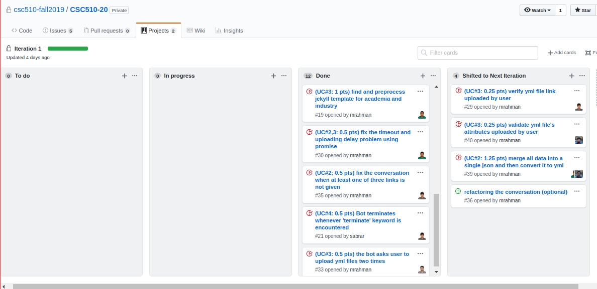
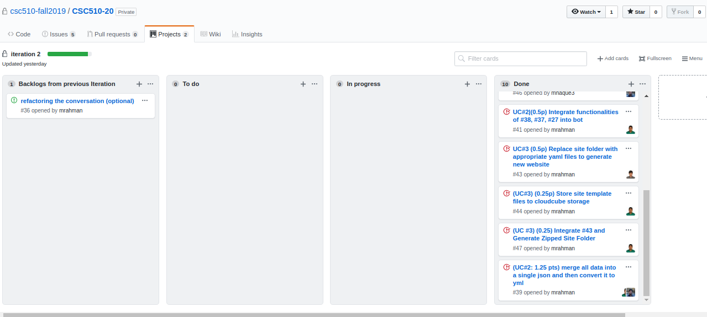

## Documentation of story creation, points and task assignment
### Iteration 1 Worksheet()
Item Number | Deliverable Story | Use-Case  | Issue Number  | Status|
|---|---|---|---|---|
|1| Writing utility functions to talk with mongo| 1 | #31  |  Done|
|2| Create a yml template that will hold all the attributes | 2 | #28 | Done| 
|3| Write exception handling when link uploading failed by bot| 2 |#34|Done|
|4| Get data from github given a url; verify if a valid link; merge them in a single json object  |2|#38| Done|
|5| Get data from dblp given a url; verify if a valid link; merge them in a single json object|2|#37| Done|
|6| Get data from linkedin given a url and token; verify if a valid link; merge them in a single json object|2|#27| Done|
|7|Refactor and reorganize the sources |Miscellaneous|#32| Done|
|8|Find and preprocess jekyll template for academia and industry |3|#19| Done|
|9|Fix the timeout and uploading delay problem using promise |2,3|#30| Done|
|10|Fix the conversation when at least one of three links is not given |2|#35| Done|
|11|Bot terminates whenever 'terminate' keyword is encountered |4|#21|Done|
|12|The bot asks user to upload yml files two times |3|#33|Done|
|13|Verify yml file link uploaded by user|3|#29|Incomplete after 1st iteration|
|14|Validate yml file's attributes uploaded by user|3|#40|Incomplete after 1st iteration|
|15|merge all data into a single json and then convert it to yml|2| #39|Incomplete after 1st iteration|

Some of the strategies we followed are given below:
1. As the worksheet clearly states, we divided the tasks that we had in hand into subtasks and classified them as per the use case. 
2. The points and the developers that were assigned to each task can be viewed in the corresponding issue number. 
3. After having set the targets for the 1st iteration, we completed almost all the tasks barring the issue numbers #29,#40 and #39. 
4. Some of the reasons that we identified for this backlog during our corresponding scrum meeting was that we underestimated the time we required to complete those tasks. 

We have provided the screenshot of the kanban board at the end of iteration 1. 

As you can clearly see the tasks that we could not complete in Iteration 1 were forwarded to Iteration 2.

### Iteration 2 Worksheet
Item Number | Deliverable Story | Use-Case  | Issue Number  | Status|
|---|---|---|---|---|
|1|Verify yml file link uploaded by user|3|#29|(From previous iteration) Done|
|2|Validate yml file's attributes uploaded by user |3|#40|(From previous iteration) Done|
|3|Merge all data into a single json and then convert it to yml|2|#39|(From previous iteration) Done|
|4|Create a git repo using npm and then push it to a repository using nodejs|3|#42|Done|
|5|Edit Industry Website YAML Template|3|#45|Done|
|6|Find out an alternative to transfer.sh.|2|#46|Done|
|7|Integrate functionalities of Issue #38, #37, #27 into bot|2|#41|Done|
|8|Replace site folder with appropriate yaml files to generate new website|3|#43|Done|
|9|Store site template files to cloudcube storage|3|#44|Done|
|10|Integrate #43 and Generate Zipped Site Folder|3|#47|Done|

1. Just like the Iteration 1, at the outset of this iteration, we decided the stories that we will implement in the scrum meeting. 
2. Some of the backlog tasks from the last iteration were reassigned and this time around we were able to complete all the tasks that were in hand. 
3. Issue #39 seemed challenging and as we mentioned we underestimated the volume and difficulty of the task. Hence, we decided to go onto pair programming approach to solve this issue.
4. There were various situations when some of the packages that we planned to use for completing the tasks did not work out well. For example, for completing the issue #42, we planned to use Simple-git package. But as we progressed with the work, we saw that the package would not serve the purpose that we are intending to have. So, while addressing the later tasks, we always had someone else other than the person assigned to do the task to search alternative ways to complete the task. 
5. NPM has so many alternatives for a single task and thats why choosing an appropriate package was particularly challenging.
6. Many of the NPM packages did not have implicit promisify functions that made our implementation tough.

We have attached the screenshot of our kanban board at the end of iteration 2.

For the details of the kanban board that we maintained, the links are provided.

Iteration 1: https://github.ncsu.edu/csc510-fall2019/CSC510-20/projects/1

Iteration 2: https://github.ncsu.edu/csc510-fall2019/CSC510-20/projects/2

## Scrum meeting
[Here](https://docs.google.com/document/d/1WSpF12QC6ngRVm-wY1Dg5f6evlgZ2TMK4O29R8ocZuU/edit?usp=sharing) is the google doc that we  used to record the meeting minutes.

The meeting minutes were also maintained in this [repository](../SCRUM_Meeting_Minutes/meetingMinutes.md).
